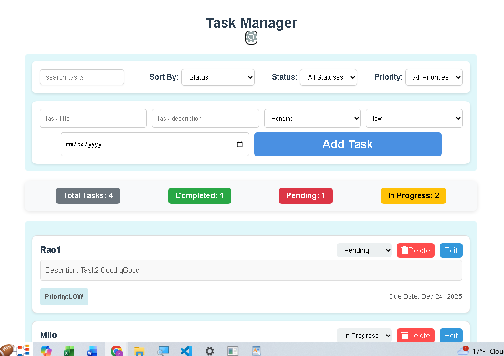
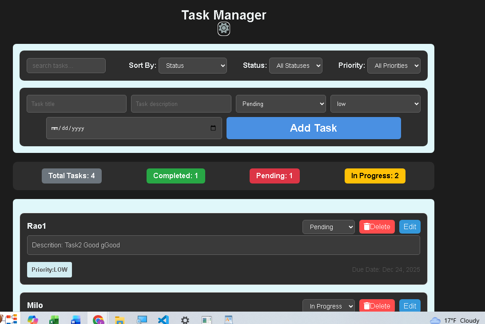

## Task Manager Application Document

## Project Overview

This project is a Task Manager application built using React and TypeScript.
The application allows users to add, edit, delete, and manage tasks efficiently.
Each task includes a title, description, priority, status, and due date.
The main goal of the project is component-based architecture, state management, and type safety using TypeScript.
The project also focuses on clean UI interaction and predictable data flow.

## Features

Add new tasks with full task details
Edit existing tasks using the same form
Delete tasks from the list
Set task priority (low, medium, high)
Track task status (pending, in-progress, completed)
Assign due dates to tasks
Sort tasks (Priority/ Status/ due date)
Form validation to prevent empty task titles
Persistent edit handling using localStorage

## How the Features Work

When a user fills the form and submits:
Validation checks are performed
A new task is added to the task list
When editing a task:
The selected task data is passed to the form
The form is prefilled using saved data
After updating, the task list is updated and the form resets
Sorting:Tasks can be sorted by Priority os Status or by due date
JavaScript comparison logic is used for ordering Status and priority:
Stored as controlled select inputs
Used for filtering and display

## Components Used

App
Root component
Holds the main task state
Passes handlers and data to child components

Dashboard
Displays task statistics and the task list
Handles filtering and sorting logic

TaskForm
Used for both adding and editing tasks
Handles validation and controlled form inputs

TaskItem
Displays individual task details
Provides edit and delete buttons

TaskList
Renders a list of TaskItem components

## How Components Interact (Workflow)

The App component maintains the main tasks array.
Task-related actions (add, edit, delete) are defined in App.
These handler functions are passed down as props.
TaskForm sends task data upward using callbacks.
Dashboard receives the task list and displays filtered and sorted results.
TaskItem triggers edit or delete actions through passed functions.
Data flows one-way (parent → child) to maintain predictable behavior.

## Reflection

1. How Components Interact (Workflow)

The App component maintains the main tasks array.
Task-related actions (add, edit, delete) are defined in App.
These handler functions are passed down as props.
TaskForm sends task data upward using callbacks.
Dashboard receives the task list and displays filtered and sorted results.
TaskItem triggers edit or delete actions through passed functions.

2.The challenges you encountered and how you overcame them

Challenge 1: Managing add and edit logic within the same form component
Solution:Separated add and edit logic clearly inside the submit handler

Challenge 2: Prefilled form data not clearing after task updates
Solution:Explicitly cleared localStorage after edit or add actions

Challenge 3:Handling validation without overcomplicating the submit logic  
Solution:Tested each feature individually to isolate bugs

Challenge:4:UI Layout Issues- Displaying priority badges, status dropdown, and edit/delete buttons clearly without overlapping.
Solution: Used CSS flexbox and spacing. Styled priority badges separately and ensured select and buttons align correctly.

Challenge:5 Sorting by date initially didn’t work  
Solution:strings needed conversion to Date objects for comparison

Challenge 6 -Debugging: Console was slow or cluttered, making it hard to debug sorting and filtering issues.
Solution: Added temporary logs in filterTask and sortTask functions. Tested with hardcoded tasks to ensure logic works before adding dynamic input.

3. Your approach to component composition and state management

# Component Composition:

Each component has a single responsibility: TaskForm for add/edit, TaskItem for display, Dashboard for filtered lists and stats.
Reusable components minimize duplication.
Data flows top-down via props; parent (App) passes callbacks for add, edit, delete, and status updates.

# State Management:

App holds main tasks state (single source of truth).
Local state (e.g., formData in TaskForm) handles temporary inputs.
Task updates propagate via callbacks for unidirectional flow.
localStorage persists temporary editing state across reloads.
Filters state controls sorting/filtering without mutating the original array.

# Advantages:

Predictable and easier to debug.
Reduced component coupling; better maintainability.
Easy to extend with new features without breaking existing logic.

# Screenshot

 --Light mode
 ----Dark Mode
